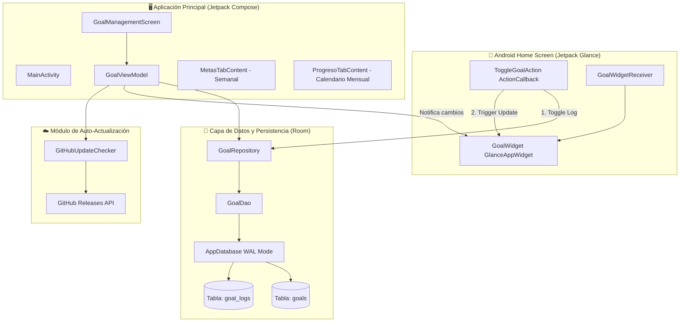

# 🏛️ Documento de Arquitectura de Software: Widget Catching Up

Documentación técnica y estructural del sistema **Widget Catching Up**, una aplicación Android nativa diseñada para el registro, seguimiento y visualización semanal/mensual de metas y hábitos mediante un **Home Screen Widget interactivo** en **Jetpack Glance** y una aplicación principal moderna en **Jetpack Compose** con estilo **Material 3**.

---

## 🎯 1. Visión General del Sistema

El objetivo principal de la aplicación es permitir un registro ultra-rápido de metas diarias desde la pantalla de inicio de Android sin fricción, eliminando la necesidad de abrir la aplicación para marcar el cumplimiento del día. A su vez, provee una aplicación complementaria para gestión de metas y análisis histórico detallado en calendarios mensuales.

### 🧩 Diagrama de Alto Nivel de Arquitectura



---

## 🛠️ 2. Stack Tecnológico

| Capa / Componente | Tecnología | Versión / Detalle |
| :--- | :--- | :--- |
| **Lenguaje** | Kotlin | `2.0.0` |
| **Framework UI App** | Jetpack Compose (BOM) | `2024.06.00` |
| **Diseño y Tema** | Material 3 (Material You) | `1.2.1` |
| **Widget UI** | Jetpack Glance AppWidget | `1.1.0` |
| **Persistencia** | Room Database + SQLite WAL | `2.6.1` |
| **Concurrencia** | Kotlin Coroutines & Flow | `1.8.1` |
| **Build System** | Gradle Kotlin DSL & Version Catalog | `Gradle 8.14`, AGP `8.5.2` |
| **Distribución** | GitHub Releases API & CLI | Auto-updater integrado |

---

## 📦 3. Estructura de Paquetes y Módulos

```
app/src/main/java/com/example/widgetcatchingup/
├── data/
│   ├── local/
│   │   ├── Goal.kt              # Entidad de meta (ID, título, posición, timestamp)
│   │   ├── GoalLog.kt           # Registro diario de cumplimiento (goalId, date, isCompleted)
│   │   ├── GoalDao.kt           # DAO con consultas SQL optimizadas
│   │   └── AppDatabase.kt       # Instancia singleton de Room con WAL y migraciones
│   ├── repository/
│   │   └── GoalRepository.kt    # Lógica de negocio, rangos de fechas y cálculo de rachas
│   └── updater/
│       └── GitHubUpdateChecker.kt # Cliente HTTP para verificar versiones en GitHub Releases
├── ui/
│   ├── theme/                   # Paletas de color, tipografía y soporte Material You
│   │   ├── Color.kt
│   │   └── Theme.kt
│   ├── viewmodel/
│   │   └── GoalViewModel.kt     # ViewModel con StateFlows reactivos
│   └── screens/
│       └── GoalManagementScreen.kt # Pantalla principal con BottomNavigation y pestañas
├── widget/
│   ├── GoalWidget.kt            # Definición visual y LazyColumn del widget Glance
│   ├── GoalWidgetReceiver.kt    # Receptor del sistema operativo Android para el widget
│   └── ToggleGoalAction.kt      # Callback para interacción de casillas directamente en widget
└── MainActivity.kt              # Punto de entrada de la actividad Android
```

---

## 🗄️ 4. Modelo de Datos y Persistencia

### 4.1. Entidades
- **`Goal`**:
  - `id: Long` (Clave primaria autogenerada)
  - `title: String` (Nombre de la meta u objetivo)
  - `position: Int` (Índice de ordenamiento para la visualización)
  - `createdAt: Long` (Marca de tiempo de creación)

- **`GoalLog`**:
  - `id: Long` (Clave primaria autogenerada)
  - `goalId: Long` (Clave foránea lógica a `Goal`)
  - `date: String` (Fecha en formato ISO `YYYY-MM-DD`, e.g., `2026-08-20`)
  - `isCompleted: Boolean` (Estado de cumplimiento del día)
  - **Índices**:
    1. Único: `[goalId, date]`
    2. Secundario: `[date]` (Optimiza consultas por mes/semana a < 1ms)

### 4.2. Optimización de Base de Datos
- **Write-Ahead Logging (WAL)**: Activado mediante `setJournalMode(JournalMode.WRITE_AHEAD_LOGGING)` para permitir lecturas y escrituras atómicas en paralelo sin bloquear los hilos de Render de Glance.
- **Migraciones Automáticas**: `MIGRATION_1_2` preserva todos los registros históricos al aplicar cambios en los índices.

---

## 🪟 5. Arquitectura del Widget (Jetpack Glance)

El widget utiliza **Jetpack Glance**, el framework declarativo moderno de Google para construir `RemoteViews` mediante sintaxis similar a Compose.

### Flujo de Interacción:
1. **Tap del Usuario**: El usuario toca una casilla en el widget de la pantalla de inicio.
2. **`ToggleGoalAction`**: Se dispara la acción `ActionCallback` con parámetros `PARAM_GOAL_ID`, `PARAM_DATE_STRING` y `PARAM_CURRENT_STATE`.
3. **Escritura Asíncrona**: Actualiza el registro en Room en background (`Dispatchers.IO`).
4. **Invalidación Inmediata**: Ejecuta `GoalWidget().update(context, glanceId)` para redibujar la UI al instante.

### Estilo Glassmorphism:
- Cada meta se dibuja en una tarjeta independiente con transparencia oscura (`#CC181C24`) y esquinas redondeadas (`16.dp`).
- Casillas marcadas en verde esmeralda (`#10893E`) y casillas vacías translúcidas (`#2EFFFFFF`).
- Resumen fijo al pie con la mejor y peor racha del mes identificadas por nombre de meta.

---

## 🔄 6. Sistema de Auto-Actualizaciones

- Consulta la API pública de GitHub: `https://api.github.com/repos/nicosuar22/widget-catching-up/releases/latest`.
- Analiza semánticamente las versiones (`v1.0.4` vs `v1.0.5`) para evitar falsos positivos.
- Dispara un `Intent.ACTION_VIEW` con la URL de descarga directa del APK (`browser_download_url`).
- Al instalar sobre la versión anterior, Android conserva íntegra la base de datos de Room.
